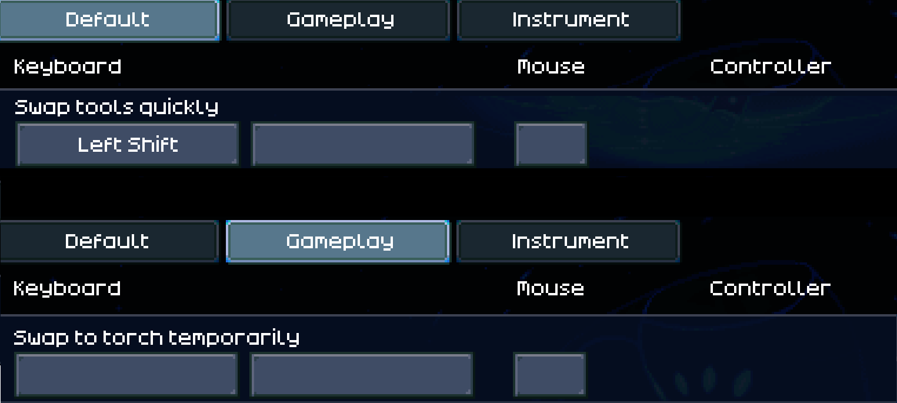

# QuickToolSwap

## Introduction 

> [!IMPORTANT]
> For this mod to work correctly, you should disable `Swap to torch temporarily` and assign a key to `Swap tools quickly` in the settings.
>
> 

<br>


Bothered by the limited space in your hotbar? With this mod, you can place items anywhere in your inventory, 
and they’ll temporarily swap into your hand based on what you’re looking at, making item management more efficient and intuitive.


---

## Usage

To temporarily replace the currently selected item in your hotbar with another item, hold down the assigned key. Once you've swapped an item, 
you won’t need to continue holding the key as long as you’re actively using it, whether you're fishing or mining.

---

## Activities

This section outlines the items that will be selected based on what you're looking at:

* **Catching:** Any critter -> Bug net
* **Farming:** Any plant -> Best hoe from inventory
* **Fishing:** Any water -> Best fishing rod from inventory
* **Mining:** Any wall or ore -> Best hand drill or pickaxe from inventory


---

## Configuration

If you want to customize the activities, you can adjust the configuration file located at<br>
`%appdata%\LocalLow\Pugstorm\Core Keeper\Steam\[your steam id]\mods\QuickToolSwap\config.cfg`

Here's an example snippet from the configuration:

```cfg
# You can name each activity as you like, but each must include `activeOn` and `priorityList`.
[Mining]

# Indicates when the item gets selected, based on what you're looking at.
# This should only include `internal names` for `object ids` or `tile types`.
activeOn = ore, wall
 
# Lists the items to be selected when the activeOn condition is met, 
# ordered by preference from highest to lowest.
# This should only include `internal names` for `object ids`.
priorityList = LightningGun, LaserDrillTool, LegendaryMiningPick, [...], CopperMiningPick, WoodMiningPick
```

For references for `internal names`, check:
* https://core-keeper.fandom.com/wiki/Object_IDs
* https://core-keeper.fandom.com/wiki/Tile_IDs

---

## Feedback

Feel free to contact me on Discord (@thomas1267) if you have any questions, bug reports, or suggestions.

